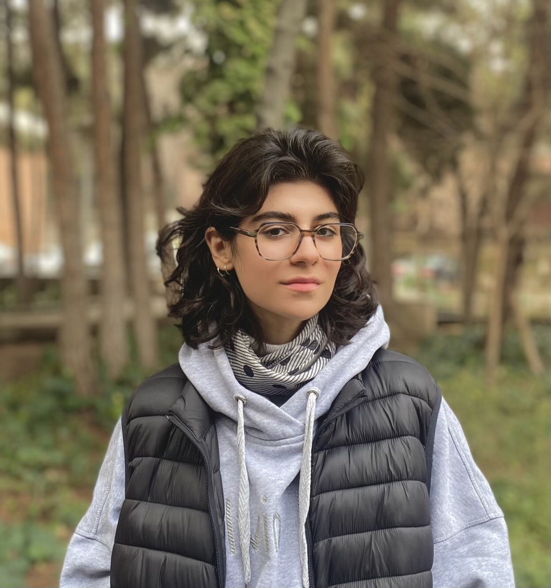

I am a researcher in prehistoric archaeology with a focus on Neolithic and Chalcolithic material cultures of the Middle East. My work centers on the intersection of archaeology and artificial intelligence, particularly in the digital analysis and classification of ceramic motifs. With hands-on excavation experience and a strong interest in ceramology, I aim to develop data-driven approaches that enhance the study of ancient pottery. I am currently conducting an research project that applies machine learning to the typological analysis of ceramics from Tepe Cheshmeh Ali, working in collaboration with experts in computer science and physics. My broader goal is to contribute to the integration of computational methods in archaeological research and heritage studies.

<h2>Skills</h2>

<ul class="skill-list">
	<li>HTML - Jade - Haml - Erb</li>
	<li>Responsive (Mobile First)</li>
	<li>CSS (Stylus, Sass, Less)</li>
	<li>Css Frameworks (Bootstrap, Foundation)</li>
	<li>Javascript (Design Patterns, Tests)</li>
	<li>AngularJS - ReactJS</li>
	<li>Grunt - Gulp - Yeoman</li>
	<li>Git</li>
	<li>PHP</li>
	<li>Python</li>
	<li>MySQL - MongoDB</li>
	<li>Scrum and Kanban</li>
	<li>TDD e Continuous Integration</li>
</ul>

<h2>Projects</h2>

<ul>
	<li><a href="https://github.com/">Lorem Lorem</a></li>
	<li><a href="https://github.com/">Ipsum Dolor</a></li>
	<li><a href="https://github.com/">Dolor Lorem</a></li>
</ul>
